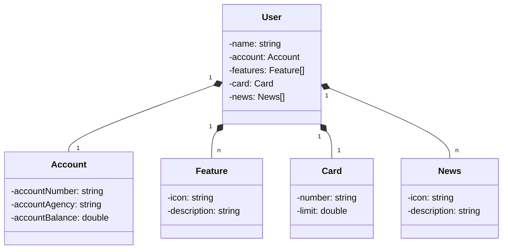

# Criando-e-Publicando-APIRest

## diagrama de classes 

```mermaid
classDiagram
    class User {
        -name: string
        -account: Account
        -features: Feature[]
        -card: Card
        -news: News[]
    }

    class Account {
        -accountNumber: string
        -accountAgency: string
        -accountBalance: double
    }

    class Feature {
        -icon: string
        -description: string
    }

    class Card {
        -number: string
        -limit: double
    }

    class News {
        -icon: string
        -description: string
    }

    User "1" *-- "1" Account
    User "1" *-- "n" Feature
    User "1" *-- "1" Card
    User "1" *-- "n" News

```
